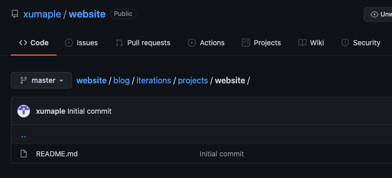
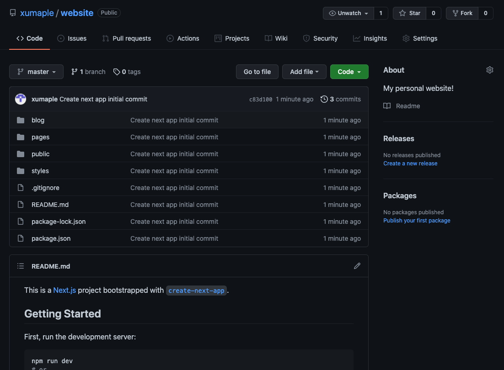

# 9/13/21 \[60 min]

Hello! This is the very first post on my blog. Today, I plan on starting a new project: creating the very website that YOU are currently viewing (hopefully)! I recently bought the domain maplexu.me to encourage myself to actually make a website, and so here we are now, after 3+ years of dreaming about what it could look like.

## THE VISION

- I want an about page, maybe about.maplexu.me or something like that - a page that either has my resume on it or gives information about me, blah blah blah, the one that I link on my resume to potential employers.
- I want an exhibit page, where I get to showcase some of the things I have worked on or created, maybe even demo in a sandbox or something…
- I want a blog page, probably blog.maplexu.me, where I write blog posts about different projects I have ongoing, such as this one I’m writing now. (But for now, this is just going in my notes app :) )
- I want some other pages that I won’t be sharing publicly (pls don’t webscrape me :/) - some of which I will be okay with being discovered, others of which I might have a password on for, just in case…

But yes, there are lots of cool things that I will hopefully be sharing and creating over the course of my career as a software developer!

## THE BEGINNING

Today, I don’t have much time. The plan is to create some kind of Github setup that will hopefully work well for me going into the future. Having to create new repositories or re-org old repositories because of crucial mistakes in planning is the worst :(

I know there are a lot of different things I want to be able to do in the future, so I toyed with the idea of creating a Github organization, with myself as the sole contributor to it…but in the end, I decided that it would work better if everything was in one centralized repo. Hopefully that doesn’t come back to bite me in the butt!

Soooo I created [my public repository](https://github.com/xumaple/website) *(side note: I couldn’t figure out how to add hyperlinks in the Apple notes app, so I guess we’re just using markdown now!)*. For now, all I know is that I want a folder holding each of my projects that I share on this blog, with an iteration for each blog post, showing my progress:



## Getting started with code

And now, finally, getting to the actual website itself: I've decided to start with my blog component. I know for sure that I want this component to be a React web app, even if a lot of it will be static, just for flexibility's sake. I don't think it'll need to be full stack (such as with a [MERN stack](https://www.kenzie.academy/blog/mean-vs-mern-vs-mevn-stacks-whats-the-difference/)), since it'll mostly be a frontend serving static blog posts... and so I went back and forth on what I should use:

- [Next.js](nextjs.org) seems like a really good option to go with for pure Javascript websites. Buuuut I am not a huge fan of javascript :)
- Using Flask/React seems like a really easy option, especially since I already have this [bootstrap code](https://github.com/xumaple/create-web-app) I created because I got tired of making new Flask/React apps from scratch...

But in the end, I chose to go with **Next.js**, since it's a technology I haven't used much of before, and I also don't want to have to worry about coding in multiple languages for this project. Plus, in my opinion, Flask is really bad... D:

So, with just a single command of ```npx create-next-app```, we have a full-blown app here:



The next question I'm asking myself is, should this whole project be *one* web app, or multiple, one for each general endpoint? If I make everything a single project, then styling things consistently becomes very simple. However, as it grows, it becomes increasingly difficult to build, since things are not as well compartmentalizeable... (wow that is a BIG word.. *is* it a word?? [Merriam webster says no...](https://www.merriam-webster.com/dictionary/compartmentalizeable))

ANYWAYS, I debated it for awhile, and I decided to proceed by building the blog component as its own web app. In the future, if I want to share styles across my multiple components, I can find some way to refactor it. Even if it has to be a bit hacky, I'm sure I'll be able to figure out a way :)

So.... everything got moved into the blog folder. Woohoo! I'm calling it a day here.

You can see my progress [here](https://github.com/xumaple/website/tree/75edb00cc49c198a7263e7c0c42d0f8dd01121d5)!