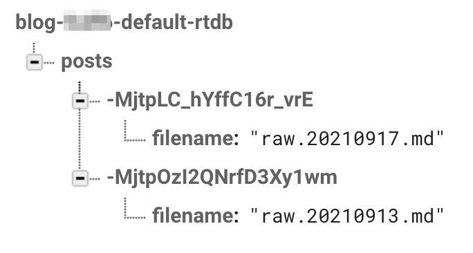

# 9/17/21 \[180 min]

Hello! Last time, I sort of got the file system set, and was able to start a localhost server with `npm run dev`. Today, my goal is to actually get the blog up and running (still on localhost), with these first two posts on the site. 

## Home page? (sort of)

I actually quite like the style that next.js default has, so I'm going to start with that and build out my blog from there. My plan for the blog's home page is to have each project be a separate section, so I tried that out, with the only project I have going for now: 

But something was wrong with the css. Rather than debugging the css and fixing it... I'm filing it for things to do later. Maybe if I add another card, it would look better...? 

Tada! Css is no longer messed up. Fix the problem by avoiding it :)

Each card is going to be linked to the project in some way, but I need to figure out how exactly to organize everything, so onto the next section...

## Blog organization

I decided to have two ways to organize all the content of this blog: a *pid* variable to represent the Post ID, and then a *prid* variable to represent the Project ID. Each project will have an aggregate of posts, and this gives me some flexibiltiy in terms of how I want to organize pages in the future. Examples might be: posts by chronological order (or reverse), posts by project, posts by some aggregate or combination of the two, etc. I also decided the respective urls for viewing a project or a post would be /post/\<pid\> and /project/\<prid\>, the most intuitive options. And I created a next file system to reflect this:

By putting [pid] and [prid] in brackets in the name of the file, I allow next.js to automatically give me the variables I need, like this:

Woohoo! My goal for the rest of today is to set up a way to map pids to their respective posts, and to be able to see the markdown file of a post displayed when I navigate to the url with its corresponding pid. Here are some of the issues I was facing:

### PID format

Should I use a number (eg. 1, 2, etc.) as the pid/prid, or a hash of some sort? When I browse blogs, sometimes I will manually edit the url to go to a new post or page. However, by using numbers, I am explicitly locking in the timeline of my blog: if I want to insert in a post between 4 and 5 in the future, there is not really a good way of doing that without shifting 5 and everything after it down by one. 

Maybe I could write a script to do it for me? ¯\\\_(ツ)\_/¯ But even then, it would mess with any hyperlinks I had pointing to other posts. This whole path is super messy and not something I want to go down. So, I've decided to give each post an auto-generated hash (how exactly I do that hasn't been decided yet). 

*Side note: I love using that shrugging kind of face. It's such a pain to write in markdown, because I have to escape my backslach and underscore characters. I need to make a script or something which automatically goes through my posts and converts any instances of /shrug into that face...*

### Static vs. dynamic blog pages

Should the markdown posts to be statically generated? There's no telling if I may write an insanely long post in the future, and as of now, I foresee no point in having each and every markdown post be regenerated when the server receives a request at its respective url. However, if the server just has all the markdown loaded upon boot, then it can statically serve them. But whenever I want to publish a new post, I'd have to reload the server.....

Having messed around with next.js a little bit as well, I also know it's not super straightforward how to read in files from the file system, even at build time. Time to mess around with it some more...

--

Alright, after some time messing with my code, I realized that if I want to be able to edit my blog posts whenever I want, then I need to load them up dynamically every time - there's just no way around it. So that's what we're going with!

### Organizing posts / macro information

If I wanted to set up a JSON with information about my blog, such as mapping hashes to filenames, which posts belong to which projects, macro info like time posted, etc., then it would grow to be a *really big JSON* file. And it would be really hard to automate. Soooo, I had a great idea: use Firebase! This way, I can also later write automated scripts to update my blog's macro information. 

So here's the Firebase file structure I set up: 

*Note*: I had a *lot* of trouble hooking up this website to firebase, nothing seemed to work for one reason or another. I had to do a few hacks to get things running, such as putting my key in a .js file instead of a .json file...

...and then called `import cert from './firebase_key.js'`. What an unfortunate setup. 

## The Progress

Alright, so after a ton of hacking around, and deciding to use the [react-markdown](https://github.com/remarkjs/react-markdown) package to render my markdown blog post files(at least for now), here is what the website looks like!

There's still a lot to do, in terms of getting it to look more presentable and also fixing those broken image links, but we'll call it a day here. 

*(also, this post labeled '9/17' technically started 9/17 and now it's 9/25 LOL, side projects really don't get much time out here..)*

You can see my progress [here](https://github.com/xumaple/website/tree/d419a26a2f5e76246df512d3c016ec50ca56b7a4/blog)!
